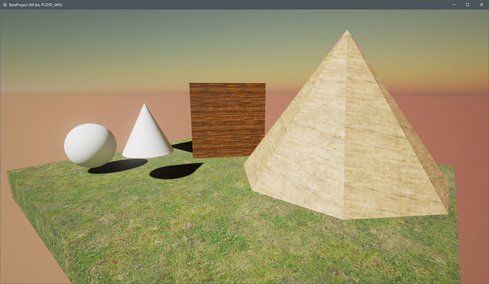

# Unreal Engine 4 - Play with Ue4

 
This is a respository of experiments with Unreal Engine 4

- [x] basic level (geometric fields, triangle, sphere, ...)
- [x] export template to be used on other projects
- [x] input keys
- [x] grow/scale object
- [x] y key to rotate (rotations)
- [x] t to translate (translations)
- [ ] cross product
- [ ] dot product
- [ ] de project and project screen positions (outputs)
- [ ] play with cameras
- [ ] metrics
- [ ] materials
- [ ] Spawn an actor by C++ code
- [ ] delegates
- [ ] c++ to blueprints and vice-versa
- [ ] create a BP for a Cpp class
- [ ] see bitbucket player input new
- [ ] difrerences between materials, textures, shapes, .....

 
